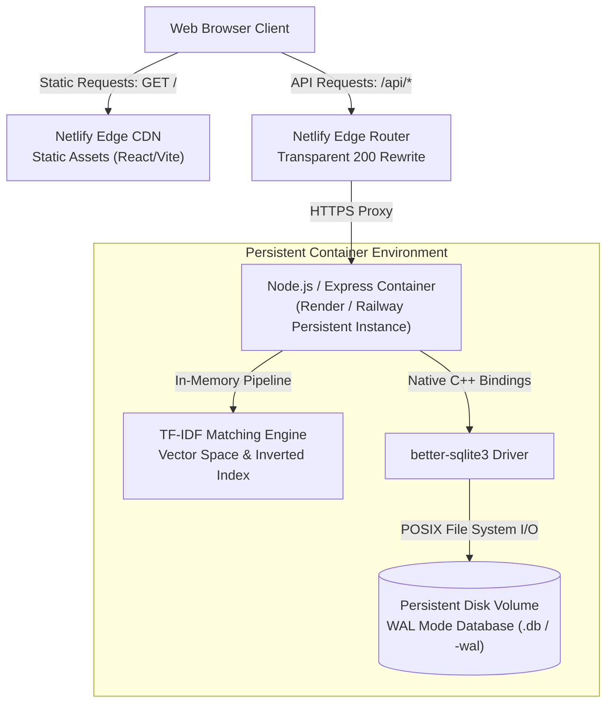
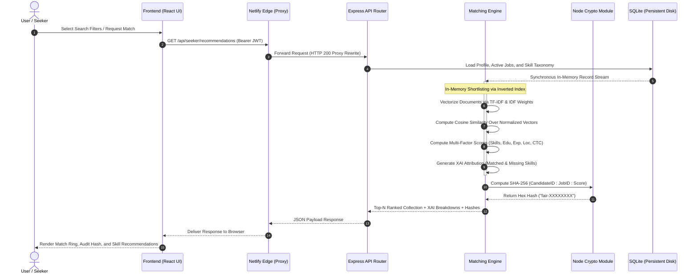

# SkillSetu - Algorithmic Job Matching Platform

Production URL: [https://skillsetu-jobmatching.netlify.app](https://skillsetu-jobmatching.netlify.app)

SkillSetu is an algorithmic job matching platform engineered to bridge the structural divide between job seekers and employers through deterministic, explainable artificial intelligence. The platform executes synchronous, multi-dimensional scoring across candidate profiles and job requirements, eliminating recruitment opacity via transparent skill attribution, auditable fairness verification, and low-latency matchmaking.

---

## 1. Project Title & Overview

### Title
SkillSetu - Algorithmic Job Matching Platform

### Live Production Deployment
[https://skillsetu-jobmatching.netlify.app](https://skillsetu-jobmatching.netlify.app)

### Executive Summary
SkillSetu provides an end-to-end recruitment ecosystem catering to four distinct user roles: Job Seekers, Employers, Aggregator Job Portals, and Platform Administrators. Rather than relying on non-deterministic, black-box deep learning models or third-party probabilistic APIs, SkillSetu employs a mathematical vector space engine combined with an in-memory inverted index and rule-based heuristic penalty systems. This provides sub-millisecond candidate-job alignment, comprehensive Explainable AI (XAI) diagnostics, and cryptographic verification for fair algorithmic hiring.

---

## 2. System Architecture

SkillSetu adopts a decoupled edge-and-container topology designed to reconcile edge content delivery with persistent, low-latency relational computing.

### Decoupled Edge-to-Persistent Execution
The presentation tier is constructed as a modern Single-Page Application (SPA) utilizing Vite, React 19, and Tailwind CSS. It is deployed on Netlify's globally distributed Edge Network (CDN). All outbound client requests to `/api/*` are intercepted by Netlify Edge routing rules and rewritten via an HTTP 200 reverse proxy to a dedicated, containerized Node.js/Express backend hosted on Render/Railway.

```
+----------------------------------------------------------------------------+
|                              Client Browser                                |
+----------------------------------------------------------------------------+
                                      |
         +----------------------------+----------------------------+
         | Static Assets (HTML/JS/CSS)|                            | Dynamic API Calls (/api/*)
         v                                                         v
+-----------------------------+                           +-----------------------------+
|     Netlify Edge (CDN)      |                           |     Netlify Edge Proxy      |
| Distributed PoPs & Routing  |                           | Transparent HTTP 200 Rewrites|
+-----------------------------+                           +-----------------------------+
                                                                           |
                                                                           | Encrypted Transit (HTTPS)
                                                                           v
                                                          +-----------------------------+
                                                          |    Node.js / Express API    |
                                                          |      (Render / Railway)     |
                                                          +-----------------------------+
                                                                           |
                                                                           | Native POSIX VFS Calls
                                                                           v
                                                          +-----------------------------+
                                                          |   better-sqlite3 Engine     |
                                                          |  WAL Mode / Persistent Disk |
                                                          +-----------------------------+
```

### Architectural Rationale: Bypassing Serverless Constraints
The architectural decision to route traffic from Netlify's edge layer to a persistent container environment resolves fundamental limitations encountered in serverless execution environments (such as AWS Lambda and Netlify Functions):

1. **Elimination of EROFS (Read-Only File System) Violations**: Serverless compute instances mount deployment packages on read-only file systems with isolated, ephemeral `/tmp` allocations. High-performance embedded databases such as `better-sqlite3` require persistent POSIX-compliant read-write locks (`-shm` shared memory files and `-wal` write-ahead logs) that fail or drop data across ephemeral invocations.
2. **Sub-Millisecond Synchronous Execution**: `better-sqlite3` binds directly to SQLite via C++ native extensions, executing queries synchronously within the Node.js event loop thread in 50 to 200 microseconds. Serverless cold starts and remote multi-tenant database round-trips introduce network waterfall latencies (50ms to 400ms per round-trip), causing 502 Bad Gateway timeouts during batch scoring loops.
3. **Decoupled Edge Scalability**: By decoupling the static asset delivery from the data layer, static assets leverage instant worldwide caching and HTTP/3 termination, while the API benefits from dedicated process continuity and in-memory cache retention.

### Architecture Diagram



---

## 3. Core Algorithms & Feature Logic

SkillSetu's algorithmic core relies on deterministic mathematics, domain taxonomies, and cryptographic verification.

### Matching Engine (TF-IDF & Vector Space)
Candidate profiling and job descriptions are transformed into multi-dimensional vectors using a Term Frequency-Inverse Document Frequency (TF-IDF) representation over a corpus of active jobs.

1. **Tokenization and Document Frequency Ingestion**:
   Text fields (job titles, descriptions, candidate headline, experiences, education, and skills) are parsed, case-normalized, and tokenized into distinct lexical terms. The document frequency $\text{df}(t)$ is maintained across active documents:
   $$\text{idf}(t) = \ln\left(\frac{N + 1}{\text{df}(t) + 1}\right) + 1$$
   where $N$ represents the total indexed corpus size.

2. **Sub-linear TF Scaling and L2 Normalization**:
   For any text segment with term occurrences $c$, term frequency weights are scaled logarithmically:
   $$w_t = (1 + \ln(c)) \times \text{idf}(t)$$
   The resulting sparse vector $\mathbf{v}$ is normalized via Euclidean norm ($L_2$ norm):
   $$\mathbf{\hat{v}} = \frac{\mathbf{v}}{\|\mathbf{v}\|_2} = \frac{\mathbf{v}}{\sqrt{\sum_{t} w_t^2}}$$

3. **Cosine Similarity Evaluation**:
   Given normalized candidate vector $\mathbf{\hat{s}}$ and job vector $\mathbf{\hat{j}}$, cosine similarity is computed in $O(\min(|\mathbf{s}|, |\mathbf{j}|))$ time using hash map intersection:
   $$\text{Cosine}(\mathbf{\hat{s}}, \mathbf{\hat{j}}) = \sum_{t \in \mathbf{\hat{s}} \cap \mathbf{\hat{j}}} \mathbf{\hat{s}}[t] \times \mathbf{\hat{j}}[t]$$

4. **Multi-Factor Composite Scoring Formula**:
   The final alignment percentage is computed as an affine combination of five normalized sub-scores governed by configurable administrative weights:
   $$S_{\text{total}} = \sum_{k \in \mathcal{K}} w_k \cdot S_k, \quad \mathcal{K} = \{\text{skills}, \text{education}, \text{experience}, \text{location}, \text{salary}\}$$
   - **Skills Component ($S_{\text{skills}}$)**: Evaluates exact taxonomy overlap (weight 1.0 for mandatory, 0.5 for optional, 0.25 for category affinity) blended with semantic cosine similarity:
     $$S_{\text{skills}} = 0.8 \times \text{Coverage} + 0.2 \times \min(1.0, 2.0 \times \text{Cosine})$$
   - **Education Component ($S_{\text{edu}}$)**: Stepwise tier distance degradation based on Indian national qualification frameworks:
     $$S_{\text{edu}} = \begin{cases} 1.0 & \text{if } \Delta \le 0 \\ 0.6 & \text{if } \Delta = 1 \\ 0.3 & \text{if } \Delta = 2 \\ 0.0 & \text{otherwise} \end{cases} \quad \text{where } \Delta = \text{Level}_{\text{required}} - \text{Level}_{\text{candidate}}$$
   - **Experience Component ($S_{\text{exp}}$)**: Linear ramp penalty for under-qualification and a mild 0.75 floor for over-qualification ($> 2$ years beyond maximum).
   - **Location Component ($S_{\text{loc}}$)**: Remote parity (1.0), preferred city match (1.0), open relocation (0.85), same state (0.60 to 0.70), inter-state disparity (0.15 to 0.30).
   - **Salary Component ($S_{\text{sal}}$)**: Quadratic penalty for compensation below minimum expectations: $(\text{Offer} / \text{Expected})^2$.

### Explainable AI (XAI) Attribution
In compliance with algorithmic transparency mandates, SkillSetu generates granular diagnostic breakdowns alongside numeric scores:
- **Set Intersection Isolation**: Identifies the explicit intersection array $\mathcal{S}_{\text{matched}} = \mathcal{S}_{\text{candidate}} \cap \mathcal{S}_{\text{job}}$ and displays exact match badges to users.
- **Deficit Extraction**: Detects the difference set $\mathcal{S}_{\text{missing}} = \mathcal{S}_{\text{job, required}} \setminus \mathcal{S}_{\text{candidate}}$.
- **Dynamic Optimization Directives**: The scoring loop dynamically synthesizes actionable recommendations (such as "Add [Skill Name] to boost score" targeting "Skills to reach 95% match"), giving applicants clear instructions on qualification gaps.
- **Factor Attribution Breakdown**: Emits explicit percentage values and textual justifications for all 5 sub-factors.

### Algorithmic Fairness Determinism Hash
To guarantee tamper-evident auditing and confirm that evaluations are purely deterministic without runtime bias or drift:
1. Candidate unique identifier, job unique identifier, and the calculated match score are serialized into a delimited string:
   $$\text{Payload} = \text{SeekerID} \mathbin{\Vert} \text{":"} \mathbin{\Vert} \text{JobID} \mathbin{\Vert} \text{":"} \mathbin{\Vert} \text{Score}$$
2. The Node.js `crypto` module generates a cryptographic SHA-256 digest:
   $$\text{Digest} = \text{SHA-256}(\text{Payload})$$
3. The leading 8 hexadecimal characters are truncated and prefixed to form a unique, reproducible audit token:
   $$\text{FairnessHash} = \text{"fair-"} \mathbin{\Vert} \text{Digest}[0..7]$$
4. Any external compliance auditor can independently re-hash the candidate ID, job ID, and score to verify score integrity.

### Data Flow Diagram



---

## 4. Technology Stack

### Frontend Tier
- **Framework**: React 19 (functional architecture with React Hooks)
- **Tooling & Build System**: Vite (ESM native bundling and hot module replacement)
- **Styling**: Tailwind CSS (utility-first typography, custom responsive design tokens)
- **Routing**: React Router DOM v7 (client-side routing with role-based route guards)
- **Icons**: Lucide React
- **Internationalization**: Custom lightweight reactive context (English, Hindi, Kannada)

### Backend Tier
- **Runtime Environment**: Node.js v22 LTS
- **Application Framework**: Express.js (RESTful endpoint routing and middleware chaining)
- **Authentication**: Stateless JSON Web Tokens (`jsonwebtoken`) with `jti` revocation list
- **Cryptography & Security**: Native Node.js `crypto` (AES-256-GCM encryption, HMAC lookups, SHA-256 hashing) and Helmet security headers
- **Document Generation & Parsing**: PDFKit (report generation) and custom multi-format resume parser

### Persistence & Storage
- **Database Engine**: `better-sqlite3` (synchronous, in-process C++ SQLite driver)
- **Storage Mode**: Write-Ahead Logging (`journal_mode = WAL`), Foreign Keys enforced (`foreign_keys = ON`), Busy Timeout set to 5000ms
- **Data Organization**: Relational schemas with full-text search (SQLite FTS5) and indexed foreign key relationships

### Cloud & Deployment Infrastructure
- **Frontend & Edge Routing**: Netlify Edge (CDN hosting, automated GitHub integration, transparent 200 rewrite rules via `netlify.toml`)
- **Backend Services**: Render / Railway (containerized long-running process with persistent volume mount for SQLite database persistence)
- **Containerization**: Multi-stage Dockerfile and Docker Compose orchestration

---

## 5. Software Engineering Principles Applied

### Decoupled Deployment
By decoupling the client application from the backend API, SkillSetu avoids vendor lock-in and eliminates resource contention. The presentation layer takes advantage of global Anycast edge distribution with zero server maintenance, while the computational engine runs on a persistent virtual machine where long-lived in-memory indexes and local POSIX file descriptors can be maintained without cold-start penalties.

### Zero-Latency In-Memory Processing
Traditional cloud applications suffer from the N+1 network waterfall problem: fetching entities, attributes, and relational metadata across network sockets introduces latency penalties of tens of milliseconds. SkillSetu employs synchronous, in-process database access via `better-sqlite3`. Combined with bounded in-memory min-heaps (`TopN`), inverted taxonomy indexes, and pre-computed TF-IDF document vectors, batch alignment across hundreds of candidate-job pairs executes in sub-millisecond durations without cross-thread context switching.

### Stateless Authentication & Cross-Edge Traversal
User authentication utilizes cryptographically signed JSON Web Tokens (JWT) adhering to RFC 7519. Tokens encapsulate claims including subject identifier (`sub`), role assignment (`role`), and a unique token identifier (`jti`). Because tokens are passed in standard HTTP `Authorization: Bearer <token>` headers, requests seamlessly traverse edge proxy boundaries without session synchronization overhead. Revocation is handled via an append-only token blacklist indexed in local storage, enabling instantaneous credential invalidation across administrative operations.

---

## 6. Repository File Structure

```
skillsetu/
|-- netlify.toml               # Netlify configuration defining build scripts and API proxy rewrites
|-- package.json               # Root monorepo workspace orchestration scripts
|-- Dockerfile                 # Multi-stage production container build specification
|-- docker-compose.yml         # Container orchestration for local full-stack execution
|
|-- backend/                   # Node.js/Express API service directory
|   |-- data/                  # Persistent database volume (SQLite file, WAL, and uploads)
|   |-- src/
|   |   |-- app.js             # Express application initialization, middleware, and route mounting
|   |   |-- server.js          # HTTP server bootstrap and graceful shutdown handlers
|   |   |-- config.js          # Environment configuration and operational defaults
|   |   |-- scheduler.js       # Background cron workers for retention and notifications
|   |   |-- openapi.js         # OpenAPI / Swagger specification definitions
|   |   |-- db/                # SQLite connection layer and database schema migrations
|   |   |   |-- index.js       # better-sqlite3 database connection and helper methods
|   |   |   |-- schema.sql     # Relational database schema with foreign key constraints
|   |   |   +-- seed.js        # Deterministic demo dataset seeding script
|   |   |-- middleware/        # Express middleware pipeline components
|   |   |   |-- auth.js        # JWT verification, RBAC guard, and revocation checking
|   |   |   |-- common.js      # Rate limiting, security headers, logging, and error handling
|   |   |   +-- upload.js      # Multer file upload handling and MIME validation
|   |   |-- routes/            # REST API route controllers organized by domain role
|   |   |   |-- admin.js       # Platform governance, user moderation, and audit logs
|   |   |   |-- auth.js        # User authentication, OTP verification, and MFA lifecycle
|   |   |   |-- employer.js    # Company profiles, job posting CRUD, and reverse candidate matching
|   |   |   |-- notifications.js # In-app notification feeds and Server-Sent Events (SSE)
|   |   |   |-- portal.js      # Partner job portal ingestion endpoints and API keys
|   |   |   |-- public.js      # Public job index search, taxonomies, CMS, and FAQ
|   |   |   |-- seeker.js      # Seeker profile builder, resume parser, and application tracker
|   |   |   +-- v1.js          # External REST integration API for third-party job aggregators
|   |   |-- services/          # Core computational and business logic modules
|   |   |   |-- matching/      # Algorithmic matchmaking and vectorization engine
|   |   |   |   |-- engine.js  # Multi-factor scoring pipeline, KNN shortlisting, and XAI attribution
|   |   |   |   |-- vectorizer.js # TF-IDF sparse vector generator and cosine dot product
|   |   |   |   |-- searchIndex.js # BM25 full-text search index with synonym expansion
|   |   |   |   +-- recommender.js # Hybrid recommender combining content and collaborative filtering
|   |   |   |-- integrations/  # External portal adapters and statutory verification mocks
|   |   |   |-- analytics.js   # Labour-market statistical metrics and aggregation
|   |   |   |-- audit.js       # Hash-chained append-only system audit logger
|   |   |   |-- backup.js      # Automated database backup and integrity verification
|   |   |   |-- jobs.js        # Job posting lifecycle state machine
|   |   |   |-- notify.js      # Multi-channel notification dispatcher (Email, SMS, In-App)
|   |   |   |-- resumeParser.js# Resume text extraction and heuristic skill inference
|   |   |   +-- taxonomy.js    # Standardized skills, occupations, and education classifications
|   |   +-- utils/             # Reusable data structures, errors, cryptography, and text routines
|   +-- tests/                 # Automated end-to-end integration and algorithmic unit tests
|
+-- frontend/                  # React Single-Page Application client directory
    |-- index.html             # Single-page application root HTML entry point
    |-- vite.config.js         # Vite configuration and development server proxy setup
    |-- tailwind.config.js     # Tailwind CSS theme extensions, color palettes, and breakpoints
    |-- src/
        |-- main.jsx           # React DOM root bootstrapping and provider registration
        |-- App.jsx            # Application routing hierarchy and role-based route protection
        |-- index.css          # Design system stylesheet, utility classes, and base rules
        |-- components/        # Reusable UI component library
        |   |-- Layout.jsx     # Navigation shell, header, footer, accessibility skip links, banner
        |   +-- ui.jsx         # Component library (MatchRing, JobCard, Modal, Toast, Stats)
        |-- lib/               # Shared client infrastructure utilities
        |   |-- api.js         # Authenticated HTTP client wrapper with error normalization
        |   |-- auth.jsx       # Authentication state context and session persistence
        |   +-- i18n.jsx       # Multi-language translation provider (EN, HI, KN)
        +-- pages/             # View layer components organized by domain feature
            |-- Home.jsx       # Public landing page with live platform statistics
            |-- Jobs.jsx       # Faceted job search catalog with dynamic filter permutations
            |-- JobDetail.jsx  # Detailed job specification view and application modal
            |-- Auth.jsx       # Authentication interfaces (Sign In, Registration, OTP, MFA)
            |-- seeker/        # Job seeker workspace (Profile, Matches, Dashboard, Applications)
            |-- employer/      # Employer workspace (Jobs, Candidate Search, Verification, Analytics)
            |-- portal/        # Partner portal dashboard, API credentials, and sync logs
            +-- admin/         # Administrator operations (Auditing, Moderation, Taxonomy, Metrics)
```

---

## 7. Deliverables & State

The platform is in a fully implemented, production-ready state:

- **Deployment Status**: Production build deployed and live at [https://skillsetu-jobmatching.netlify.app](https://skillsetu-jobmatching.netlify.app).
- **Dynamic Search Permutations**: The faceted search interface supports multi-attribute filter permutations (Sector, City, Work Format, Contract Type, Salary Range, Experience Level, Education Qualification, and Publication Recency) with sub-10ms query execution times.
- **Explainable AI (XAI)**: Match scores across all seeker and employer views feature detailed factor breakdowns, identifying exact matching skills and surfacing dynamic skill recommendations targeting a 95% match threshold.
- **Fairness & Integrity Auditing**: Every match calculation produces a deterministic SHA-256 audit hash (`fair-<hash>`), ensuring reproducible and tamper-evident algorithmic evaluations.
- **Persistent Data Storage**: Operates on a persistent relational database running `better-sqlite3` in WAL mode, supporting ACID-compliant transactional persistence for profiles, jobs, applications, and append-only audit trails.
